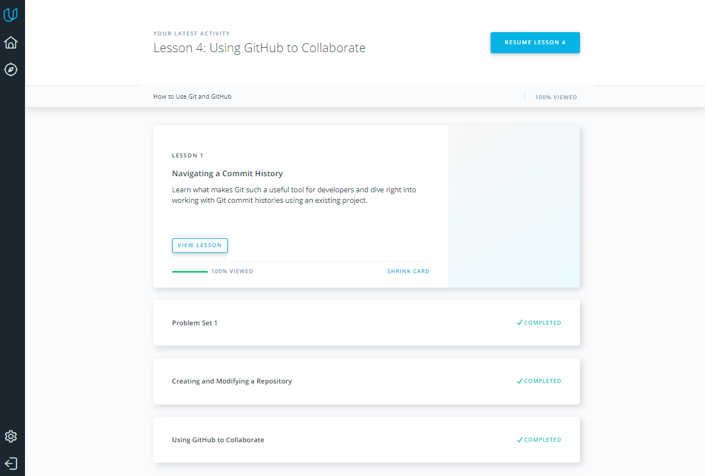

# kottans-frontend
### TASK 0

**How to use git and github**
 
- Now I know another platform for save documents exept Dropbox, GoogleDocs,SVS.
- I have studied the basic principles of management Git Bash.
- I know how using repository and his the basic functions(git diff,log,init.status,add,commit -m"",branch,checkout,merge,pull,push, ls -a,remote  etc).
- I belive that my Knowledge help my to master more complex material
 

