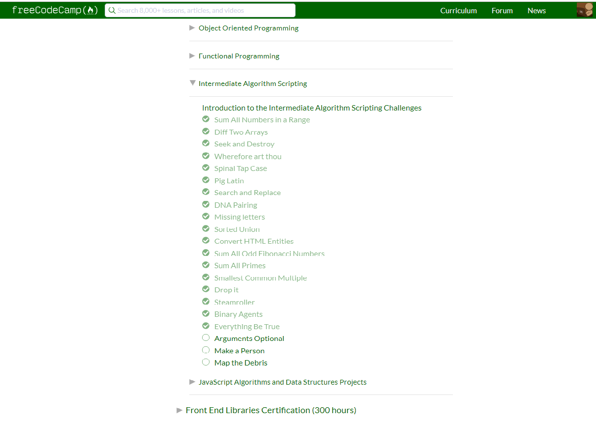

-+# kottans-frontend
### How to use git and GitHub

 
 
- Now I had learned another one platform for saving documents except Dropbox, GoogleDocs, SVN.
- I have studied the basic principles of management Git Bash.
- I know how using repository and his the basic functions(git diff,log,init.status,add,commit -m"",branch,checkout,merge,pull,push, ls -a,remote  etc).
- I believe that my Knowledge will help me to master the more understand complicated material

 

### Git and GitHub

.png)

- Thanks to this course, I managed to consolidate and improve the material that I learned in the previous task.
- Also, now I know more basic commands such as git reset, git revert, git -reflog, git shortlog etc.

### Linux CLI, and HTTP

- On this course, I got to know the main commands of the Command Line.
- The material I studied allows me to create, edit and delete files and folders through the command line.
- Also, I got acquainted with the structure of the URL, methods and status codes - three pillars of communication using HTTP.

### Intro to HTML and CSS

- This course helped me to reestablish basic knowledge in HTML and CSS.
- Although the course in htmlacademy was not new to me, it was interesting to rebuild my knowledge.
- Yet, after completing this course, I would recommend Kottans to suggest that students first pass the "HTML Academy", and then offer students a course on Udacity.

### Responsive Web Design

- I've learned to the basics of well-sized elements for mobile,
using breakpoints and mediaqueries, tochange the page layout for different devices.
- At this point, i've got all the tools and concepts you need to build amazing responsive sites.
- I was pleased with the frog game based on the use of flex elements. I gladly passed it, remembering all the flex capabilities.

### JS Basics

 - Thanks to this course, I became acquainted with the basics of JS. Theoretically (and partially practically) I know what is a variable, loops (while and for), a function, an array, and an object.
 - More practical to master knowledge, mainly on using the array and its properties and methods, helped the freecodecamp.
 - In general, in my opinion, these basic knowledge is sufficient for continuing education in the field of JS.

### DOM

		

- I learned about the DOM, how it is built, how to choose an identifier, a class, and a tag.
- I learned about the NOSE interface and the Element interface.
- I learned new DOM methods that allow you to modify and manage the content of a page.

[My practical task](https://zophrox.github.io/first-practice-dom/)

## Object Oriented JS

 - I learned about the most important and complex JavaScript language features, including areas, closures, keyword this and prototype chains.
 - I also learned a lot of different code reuse patterns that are built on top of those features, such as function decorators and all of the major classing and subclassing patterns that are available within JavaScript.

